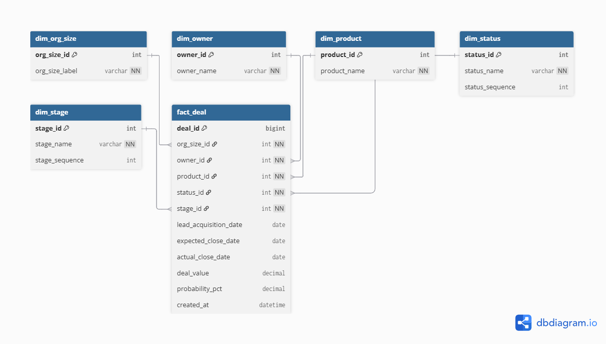
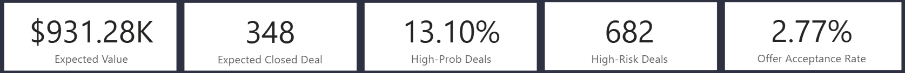
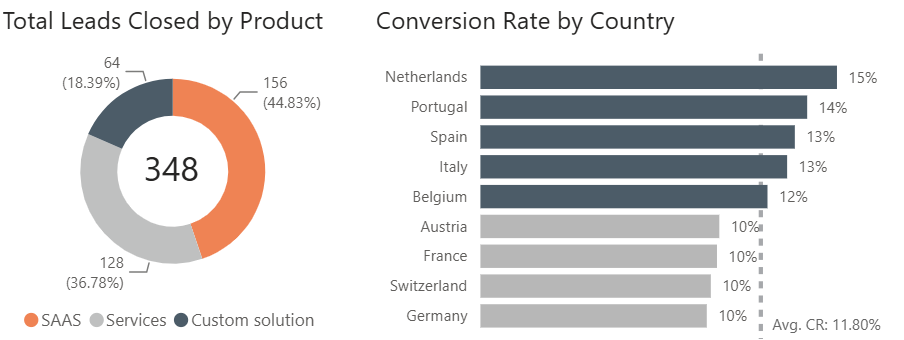
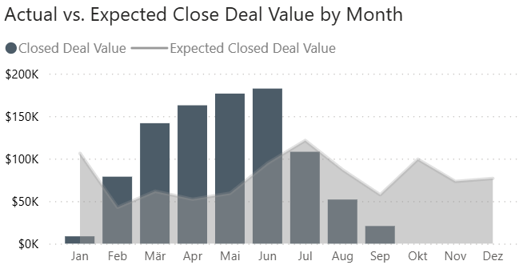
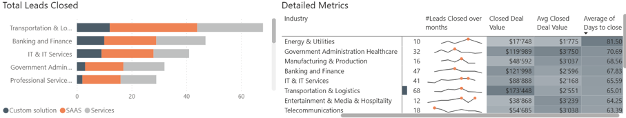
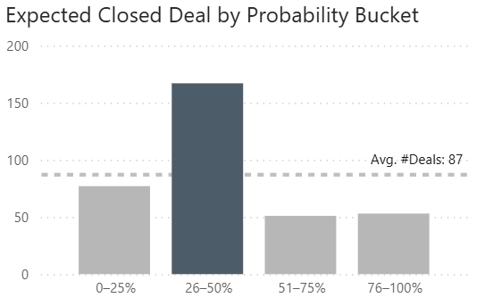
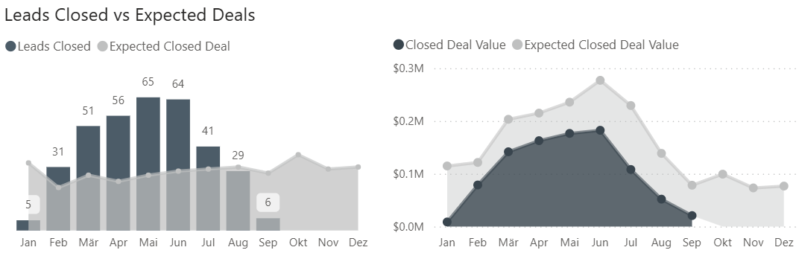
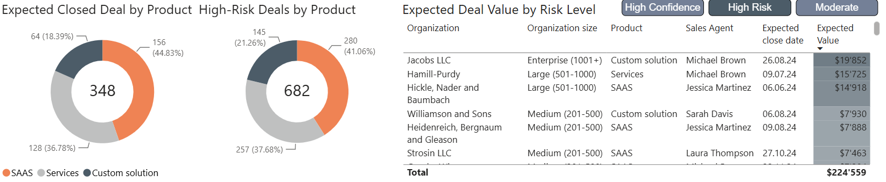

# CRM and Sales Pipeline Analysis

## Background

A company aims to evaluate its CRM data and sales pipeline for leads registered over the last five months. The analysis focuses on understanding lead distribution, sales performance, pipeline health, expected revenue, and potential risks across different markets and customer segments.

The purpose of this project is to consolidate these signals into an interactive Power BI dashboard that provides a clear overview of current sales performance and future opportunities. It helps identify what drives successful conversions, where deals are being lost, and which areas require further attention.

The report provides insights and recommendations across the following areas:

- **Lead Distribution and Pipeline Overview:** Analyse leads by country, industry, organization size, product, and sales agent to understand how opportunities are distributed across the pipeline.
- **Sales Performance and Conversion:** Evaluate closed deal value, conversion rate, win rate, lost rate, open leads, and average days to close.
- **Sales Agent Performance:** Compare the number of leads closed, total closed deal value, average deal value, and average closing time for each sales agent.
- **Revenue Forecasting:** Compare actual and expected closed deal values by month to estimate potential income and identify performance gaps.
- **Pipeline Probability and Risk Analysis:** Group opportunities by closing probability and identify high-probability and high-risk deals.
- **Product and Market Analysis:** Assess the performance of SaaS, Services, and Custom Solutions across countries and customer segments.

## Project Resources

- [View the interactive Power BI dashboard](https://app.powerbi.com/view?r=eyJrIjoiNGY0OTcwODQtNTc4Mi00MjQzLTk1YmMtZWYzNDUwMjVkNzUwIiwidCI6ImNiNDg0NDZlLTkwZTYtNGJmMS04MjViLTQwZTQ4ZmNjOWZmNiJ9)
- [View the SQL scripts used to prepare the data](./crm_prep.sql)
- [View the targeted business analysis queries](./crm_performance_validation.sql)

---

# Data Pipeline and Reporting Setup

## Step 1: Installing the Database

First, I installed SQL Server Management Studio (SSMS) on my local machine and ran the database installation scripts. These scripts created the required tables and loaded the CRM and sales pipeline data into the database.

## Step 2: Writing the SQL Scripts

I reviewed the database schema and wrote SQL queries to clean, organize, and transform the source data into a reporting-ready model.

The model follows a star-schema structure, with the central `fact_deal` table connected to the following dimension tables:

- `dim_org_size`
- `dim_owner`
- `dim_product`
- `dim_status`
- `dim_stage`

The `fact_deal` table contains the main sales pipeline information, including:

- Lead acquisition date
- Expected and actual closing dates
- Deal value
- Closing probability
- Sales agent
- Product
- Pipeline stage
- Deal status

## Step 3: Building the Data Model in Power BI

I connected Power BI to the SQL Server database and imported the prepared fact and dimension tables.

One-to-many relationships were created between the dimension tables and the central `fact_deal` table using their corresponding primary and foreign keys. This structure supports consistent analysis by product, sales agent, organization size, pipeline stage, and deal status.

DAX measures and calculated fields were created for the main business metrics, including:

- Closed and expected deal value
- Number of open and closed leads
- Conversion, win, loss, and offer acceptance rates
- Average deal value
- Average days to close
- High-probability opportunities
- High-risk opportunities

## Step 4: Creating the Dashboards

The final step involved creating an interactive Power BI report containing two main pages:

1. **Sales Performance Overview**
2. **Forecast and Risk Analysis**

The following Power BI features were used:

- DAX measures
- Interactive slicers
- KPI cards
- Field parameters for switching analysis dimensions
- Buttons and page navigation
- Conditional formatting
- Dynamic titles and labels
- Donut, bar, line, area, and combination charts
- Detailed tables and matrix visuals
- Custom number formatting
- Report interactions and cross-filtering

---

# CRM Performance Snapshot

## Overview of Findings

The CRM pipeline generated **$931.28K in closed deal value** from **348 closed deals**, with an overall conversion rate of **11.60%**. A further **65 leads remained open**, representing additional opportunities still progressing through the sales pipeline.

Sales efficiency remains an area for improvement. Deals required an average of **63 days to close**, while the dashboard recorded a **2.77% win rate** and a **2.03% lost rate**. The **2.77% offer acceptance rate** also indicates that only a small share of leads successfully progressed to an accepted offer.

The current pipeline carries an expected value of **$931.28K**, with **13.10% of deals classified as high probability**. However, **682 deals were identified as high risk**, showing that a substantial portion of the pipeline may require closer follow-up, improved qualification, or revised probability and closing-date estimates.

---

# Sales Performance Deep Dive

## Product and Market Performance

- **SaaS was the strongest product category**, accounting for **156 closed deals or 44.83%**, followed by Services with **128 deals or 36.78%** and Custom Solutions with **64 deals or 18.39%**.
- The **Netherlands recorded the highest conversion rate at 15%**, followed by Portugal at **14%**.
- Spain and Italy both reached **13%**, while several markets remained below the **11.80% average conversion rate**.
- SaaS and Services are the main drivers of sales volume, while practices from stronger-performing countries may help improve conversion in lower-performing markets.

## Monthly Deal Value Trends

- Closed deal value increased strongly during the first half of the year, rising from approximately **$80K in February** to more than **$180K in June**.
- Actual performance exceeded expected deal value from **March through June**, indicating strong pipeline conversion during this period.
- From **July onward**, closed deal value declined and remained below expectations.
- The decline may indicate delayed deals, weaker pipeline progression, or fewer opportunities reaching the closing stage.

## Industry Performance

- **Transportation and Logistics** recorded the strongest overall performance, with **68 closed leads** and approximately **$173.45K in closed deal value**.
- Banking and Finance followed with **47 closed leads and $122.00K**, while IT and IT Services generated **41 closed leads and approximately $88.89K**.
- Government Administration and Healthcare achieved the highest average closed deal value at approximately **$3.75K per deal**, despite closing fewer leads than the leading industries.
- Energy and Utilities had the longest average closing time at approximately **82 days**, while Telecommunications recorded the shortest among the displayed industries at approximately **63 days**.

These differences may reflect variations in deal complexity, decision-making processes, and customer requirements.

---

# Pipeline Forecast and Risk Deep Dive

## Deal Probability and Forecast Outlook

- The largest concentration of expected deals falls within the **26–50% probability range**, with approximately **168 opportunities**.
- This is well above the average of **87 deals per probability bucket**.
- Only **13.10% of opportunities are classified as high probability**, indicating that much of the pipeline remains uncertain.
- The limited number of deals in the higher-probability categories may reduce forecast reliability unless medium-probability opportunities progress toward closure.

## Actual versus Expected Performance

- Closed deal volume increased from **5 deals in January** to a peak of **65 deals in May**, before declining to **6 deals by September**.
- Closed deal value followed a similar pattern, reaching its highest level around June before falling during the following months.
- Actual results remained below expected deal value in the forecast analysis, suggesting that some opportunities may have been delayed, overestimated, or moved to later closing dates.

## High-Risk Opportunity Analysis

- The dashboard identifies **682 high-risk deals**, with SaaS accounting for the largest share at **280 deals or 41.06%**.
- Services represents **257 high-risk deals or 37.68%**, while Custom Solutions contributes **145 deals or 21.26%**.
- The selected high-risk opportunities represent approximately **$224.56K in expected value**.
- High-value opportunities should be prioritised according to their expected closing date, current probability, assigned sales agent, and risk classification.

---

# Recommendations

## Focus growth efforts on Transportation and Logistics

- **Action:** Prioritise lead generation and account expansion within Transportation and Logistics.
- **Rationale:** This industry generated the highest number of closed leads and the greatest total closed deal value, indicating strong demand and proven sales potential.

## Target high-value Government and Healthcare opportunities

- **Action:** Increase focus on qualified prospects in Government Administration and Healthcare.
- **Rationale:** Although deal volume was lower, this industry recorded the highest average closed deal value, suggesting strong revenue potential per opportunity.

## Improve the Energy and Utilities sales cycle

- **Action:** Review qualification, stakeholder engagement, and follow-up processes for Energy and Utilities deals.
- **Rationale:** This industry had the longest average closing time, indicating potential delays or inefficiencies within the sales process.

## Expand proven mid-performing industries

- **Action:** Develop additional opportunities in Banking and Finance and IT and IT Services.
- **Rationale:** Both industries delivered solid lead volume and closed deal value, making them suitable areas for scalable growth.

## Prioritise high-risk, high-value opportunities

- **Action:** Focus sales follow-up on high-risk deals with large expected values and approaching closing dates.
- **Rationale:** The pipeline contains 682 high-risk deals, including selected opportunities representing approximately $224.56K in expected value.

    └── CRM-Sales-Pipeline-Analysis.pbix
